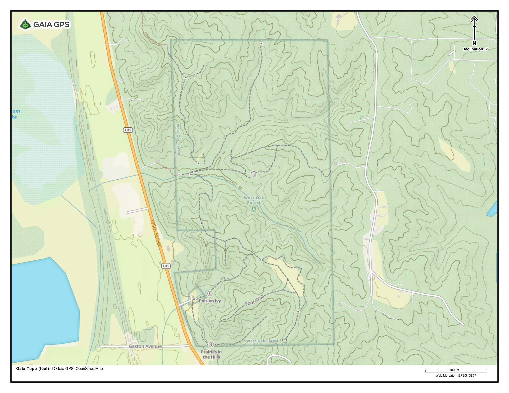

# Omaha, NE Local Hiking

This is a collection of some of my favorite hiking venues around the Omaha, Nebraska metro.  This is a mix of general hiking "areas" and specific trails.  List is generally organized from North to South.

## Jones Creek Pond and Sarah's Trail

- **Location:** Loess Hills State Forest near Moorhead, IA
- **Distance:** 3.3 mi
- **Description:** A relatively easy pine-covered trail following a ridge down from one of the main access roads in Preparation Canyon State Park.  Can be hiked either direction, either as an out-and-back, or one-way with a vehicle parked at either end.  The loop around the west side of Jones Creek Pond is worth the walk, but the hike can also be shortened by following the trail on the east side of the lake or by parking in the small lot where the trail crosses the road.

## West Oak Forest

- **Location:** Mills County, IA

- **Description:** West Oak forest is a small county park in the bluffs on the east side of the Missouri River with a network of relatively short trails (and steep climbs).  A loop on through the south ridgeline prairie and overlook is shown below.

