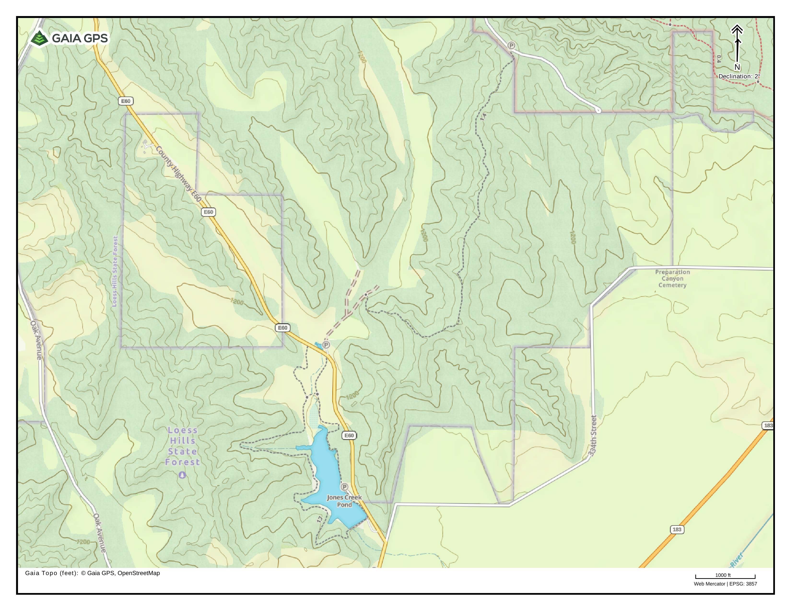
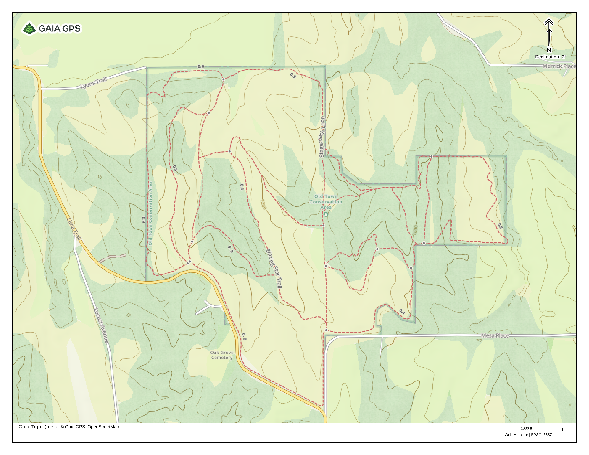
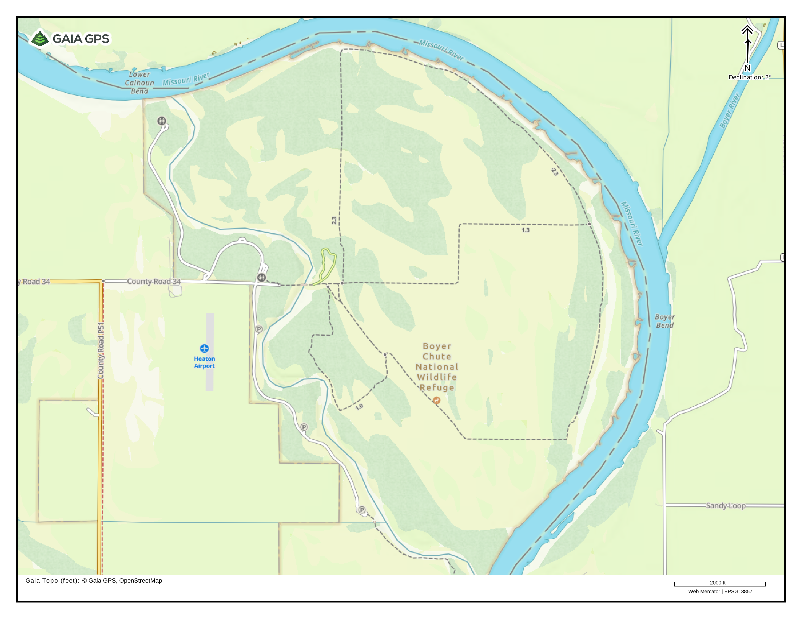
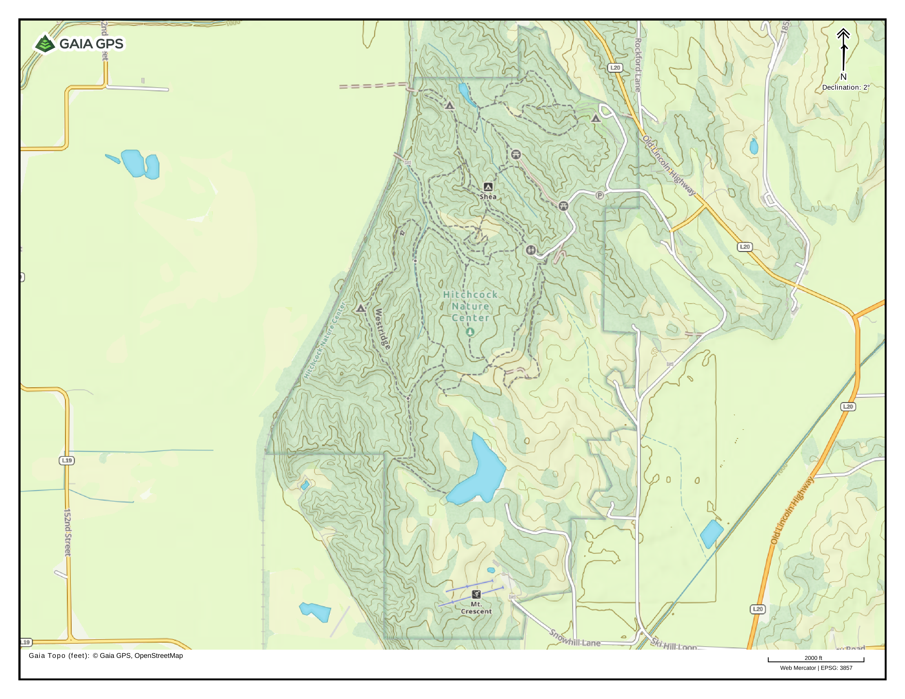
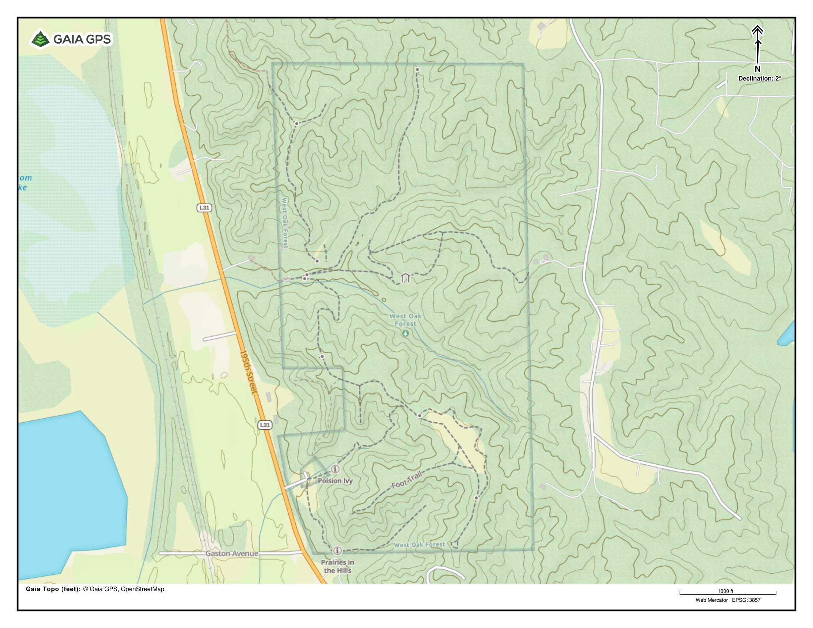

# Omaha, Nebraska Local Hiking

his is a collection of some of my favorite hiking venues around the Omaha, Nebraska area, **organized roughly from North to South**.  It's a mix of parks, forests, and wildlife preserves within about an hour of the metro.  Most of these places have a network of trails that are worth checking out, but sometimes I'll point out a specific one if it's notable.



## Sarah's Trail from Preparation Canyon to Jones Creek Pond

**Location:** [Loess Hills State Forest near Moorhead, IA](https://maps.app.goo.gl/QY76BzfAHYM2XgRk7)

**Distance:** 3.3 mi

A relatively easy pine-covered trail following a ridge down from one of the main access roads in Preparation Canyon State Park.  Can be hiked either direction, either as an out-and-back, or one-way with a vehicle parked at either end.  The loop around the west side of Jones Creek Pond is worth the walk, but the hike can also be shortened by following the trail on the east side of the lake or by parking in the small lot where the trail crosses the road.

[View as PDF](sarahs-trail.pdf)

## Old Town Conservation Area

**Location:** Missouri Valley, IA

A quiet park in the hills to the south of Missouri Valley with a mix of hilltop prairie and forest, connected with a modest trail network.

[View as PDF](old-town-conservation-area.pdf)

## Boyer Chute National Wildlife Refuge

**Location:** [Near Fort Calhoun, NE](https://maps.app.goo.gl/tJsn4NghTuvVugyg8)

Riverside wildlife refuge a few miles outside of Fort Calhoun, NE with a ~9 mi. trail loop.  Trails are flat, well-mowed, and easy to follow.

[View as PDF](boyer-chute.pdf)

## Hitchcock Nature Center

**Location:** [Near Crescent, IA](https://maps.app.goo.gl/ipgw71iUWx5cMqjX7)

One of the de-facto hiking spots for the Omaha metro.  Hilly trail network with plenty of deep valleys and ridgelines with views of the surrounding river valley and downtown Omaha.

[View as PDF](hitchcock.pdf)

## West Oak Forest

**Location:** Mills County, IA

**Description:** West Oak forest is a small county park in the bluffs on the east side of the Missouri River with a network of relatively short trails (and steep climbs).  A loop on through the south ridgeline prairie and overlook is shown below.

[View as PDF](west-oak-forest.pdf)

